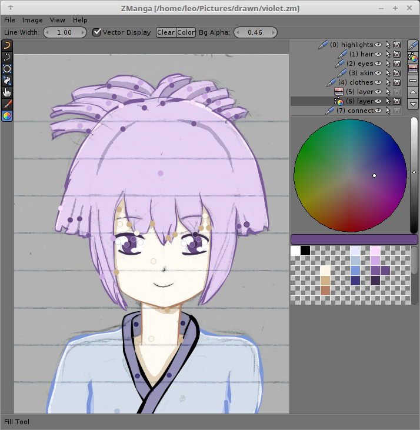
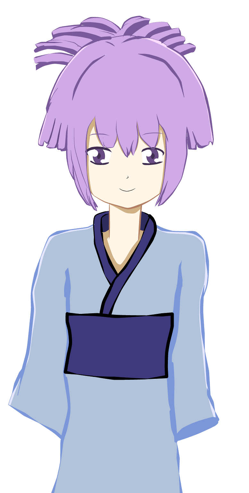

# ZManga v1.0
ZManga is an application for drawing lineart with mouse written in Java.

## Features

* Lineart Layer
  * lines, curves, and shapes are drawn as vectors
  * shapes can be edited at with edit tool
  * variable line thickness can be adjusted with width tool
  * line color and fill color or shapes can be set with color tool

* Color Layer
  * lets you draw color points, which color your drawing by pressing the Color button
  
* Image Layer
  * lets you add a background image which you can use as a reference

* Colors
  * Colors Picker (by pressing P)
  * You can store current color in the pallete (Shift-LeftClick), or remove it (Shift-RightClick)
  * You can link shapes color with the pallete (Ctrl-LeftClick), then select color on the color wheel. (Ctrl-LeftClick) to apply or (Ctrl-RightClick) to cancel. 
  
* Export
  * you can export your image to png format. 
  
TIP: You can export your image at 4x your image resolution, by typing "4" in the Export dialog without ticking Antialiasing. This allows you to easily select colored areas in another drawing application. Later, you can scale the image down to get smooth lines.

## ScreenShot

### Export

Exported with 4x resolution and scaled down:

## Download

Download is available at: https://github.com/TehLeo/ZManga/releases/
Requirements: Java8+

## Support & Donations

Would you like to support zManga?
You can report bugs or request for a new features at: https://github.com/TehLeo/ZManga/issues

Or would you like to make a donation?
You can do so at: https://www.paypal.me/JurajPapp
