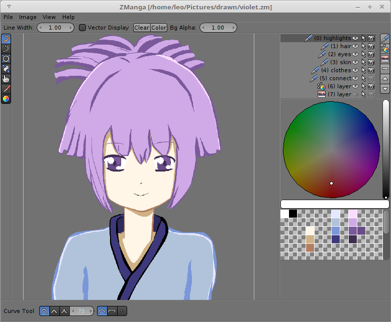

# ZManga v1.0
ZManga is an application for drawing lineart with mouse written in Java.

## Download

Download is available at: https://github.com/TehLeo/ZManga/releases/
Requirements: Java8+

## Support & Donations

Would you like to support zManga?
You can report bugs or request for a new features at: https://github.com/TehLeo/ZManga/issues

Or would you like to make a donation?
You can do so at: https://www.paypal.me/JurajPapp
